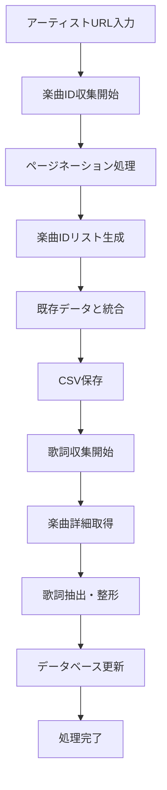

# UTA-NET 歌詞スクレイピングシステム 🎵

## 📖 システム概要

UTA-NET歌詞スクレイピングシステムは、日本最大級の歌詞検索サイト「uta-net.com」から楽曲情報と歌詞を自動収集する高性能Pythonツールです。大量の楽曲データを効率的に収集し、構造化されたCSV形式で保存することで、音楽データ分析や研究用途に最適化されています。

### 🌟 システムの特徴

- **完全自動化**: 楽曲ID収集から歌詞取得まで全工程を自動化
- **大規模処理対応**: 数千曲規模のデータ収集に対応
- **増分更新**: 既存データを保持しながら新規楽曲のみを追加
- **エラー耐性**: ネットワークエラーやサイト構造変更に柔軟対応
- **進行状況可視化**: リアルタイム進捗表示で処理状況を監視
- **データ品質保証**: 重複防止と欠損データ対応

## 🔧 システム構成

### ファイル構成
```
uta-net/
├── scripts.py              # メインスクレイピングエンジン
├── lyrics_data.csv          # 歌詞データベース（自動生成）
├── song_ids_134.csv         # 楽曲IDリスト（自動生成）
├── dev.ipynb               # 開発・テスト用ノートブック
├── main.ipynb              # メイン実行用ノートブック
├── requirements.txt         # 依存関係定義
└── README.md               # システム説明書（このファイル）
```

### 主要コンポーネント

#### 1. `get_and_save_song_ids()` - 楽曲ID収集エンジン
```python
def get_and_save_song_ids(artist_page_url, filepath=None)
```
- **機能**: アーティストページから全楽曲のIDを収集
- **対応**: ページネーション自動処理
- **出力**: `song_ids_{artist_id}.csv`

#### 2. `scrape_and_save_lyrics()` - 歌詞収集エンジン
```python
def scrape_and_save_lyrics(song_id_list, filepath=None, artist_id=None)
```
- **機能**: 楽曲IDリストから詳細情報と歌詞を収集
- **出力**: `lyrics_data_{artist_id}.csv`

#### 3. `get_song_details_and_lyrics()` - 楽曲詳細取得エンジン
```python
def get_song_details_and_lyrics(song_id)
```
- **機能**: 単一楽曲の全詳細情報を取得
- **戻り値**: 楽曲データ辞書

## 🚀 セットアップガイド

### 1. 環境準備
```bash
# リポジトリのクローン
git clone <repository-url>
cd uta-net

# 仮想環境の作成（推奨）
python -m venv venv
source venv/bin/activate  # Windows: venv\Scripts\activate

# 依存関係のインストール
pip install -r requirements.txt
```

### 2. 必要ライブラリ
```
requests>=2.28.0        # HTTP通信
beautifulsoup4>=4.11.0  # HTML解析
pandas>=1.5.0           # データ処理
tqdm>=4.64.0           # 進行状況表示
```

## 📋 システムフロー

### 基本的な処理フロー



### 詳細な実行フロー

#### Phase 1: 楽曲ID収集
1. **アーティストページアクセス**
   - 指定されたアーティストURLにアクセス
   - HTMLレスポンスの取得と検証

2. **ページネーション処理**
   - 1ページ目: 直接アーティストURL
   - 2ページ目以降: `/artist/{artist_id}/0/{page}/`形式
   - 最大100ページまで自動処理

3. **楽曲リンク抽出**
   - クラス `py-2 py-lg-0` の`<a>`タグを検索
   - `/song/` を含むhref属性から楽曲IDを抽出

4. **データ統合と保存**
   - 既存CSVファイルの読み込み
   - 新規IDのみを追加（重複排除）
   - ソート済みリストとして保存

#### Phase 2: 歌詞収集
1. **処理対象の決定**
   - 既存データベースの読み込み
   - 未処理楽曲IDの特定

2. **楽曲詳細取得**
   - 各楽曲ページへの個別アクセス
   - HTML解析によるデータ抽出

3. **データ構造化**
   - 以下の情報を体系的に収集:
     - 基本情報: タイトル、アーティスト、楽曲ID
     - 制作情報: 作詞者、作曲者、編曲者
     - リリース情報: 発売日、主題歌情報
     - メディア: カバー画像URL
     - 歌詞: 完全なテキスト

4. **データベース更新**
   - CSV形式での逐次保存
   - UTF-8エンコーディング対応

## 🎯 使用方法

### 基本的な使用方法

#### 1. 簡単な実行例
```python
import scripts

# Step 1: 楽曲IDを収集
artist_url = "https://www.uta-net.com/artist/134/"
song_ids = scripts.get_and_save_song_ids(artist_url)
print(f"収集した楽曲数: {len(song_ids)}件")

# Step 2: 歌詞を一括取得
scripts.scrape_and_save_lyrics(song_ids, artist_id="134")
print("歌詞収集完了")
```

#### 2. カスタマイズ例
```python
# カスタムファイル名での保存
song_ids = scripts.get_and_save_song_ids(
    artist_page_url="https://www.uta-net.com/artist/134/",
    filepath="my_custom_song_ids.csv"
)

# 特定の楽曲リストから歌詞を取得
selected_songs = ["123456", "234567", "345678"]
scripts.scrape_and_save_lyrics(
    song_id_list=selected_songs,
    filepath="selected_lyrics.csv",
    artist_id="134"
)
```

#### 3. 個別楽曲処理
```python
# 単一楽曲の詳細取得
song_data = scripts.get_song_details_and_lyrics("123456")
print(f"タイトル: {song_data['title']}")
print(f"アーティスト: {song_data['artist']}")
print(f"歌詞:\n{song_data['lyrics']}")

# 後方互換性関数の使用
title, lyrics = scripts.get_song_title_and_lyrics("123456")
```

### 応用的な使用方法

#### バッチ処理
```python
# 複数アーティストの一括処理
artists = [
    "https://www.uta-net.com/artist/134/",
    "https://www.uta-net.com/artist/256/",
    "https://www.uta-net.com/artist/789/"
]

for artist_url in artists:
    try:
        song_ids = scripts.get_and_save_song_ids(artist_url)
        artist_id = artist_url.rstrip('/').split('/')[-1]
        scripts.scrape_and_save_lyrics(song_ids, artist_id=artist_id)
        print(f"アーティスト{artist_id}の処理完了")
    except Exception as e:
        print(f"エラー: {e}")
```

#### 増分更新
```python
# 定期的な新曲チェックと追加
import schedule
import time

def update_artist_data():
    artist_url = "https://www.uta-net.com/artist/134/"
    song_ids = scripts.get_and_save_song_ids(artist_url)
    scripts.scrape_and_save_lyrics(song_ids, artist_id="134")
    print("データ更新完了")

# 毎日午前3時に実行
schedule.every().day.at("03:00").do(update_artist_data)
```

## 📊 出力データ形式

### 楽曲IDファイル (`song_ids_{artist_id}.csv`)
```csv
song_id
123456
234567
345678
```

### 歌詞データベース (`lyrics_data_{artist_id}.csv`)
```csv
song_id,title,artist,main_theme,lyricist,composer,arranger,release_date,cover_url,lyrics
123456,"Sample Song","Sample Artist","TVアニメ「Sample」主題歌","作詞者","作曲者","編曲者","2023.01.01","https://...",歌詞テキスト
```

#### データ項目詳細
| 項目 | 説明 | 例 |
|------|------|-----|
| song_id | 楽曲の一意識別子 | "123456" |
| title | 楽曲タイトル | "残酷な天使のテーゼ" |
| artist | アーティスト名 | "高橋洋子" |
| main_theme | 主題歌情報 | "TVアニメ「エヴァンゲリオン」オープニングテーマ" |
| lyricist | 作詞者 | "及川眠子" |
| composer | 作曲者 | "佐藤英敏" |
| arranger | 編曲者 | "大森俊之" |
| release_date | 発売日 | "1995.10.25" |
| cover_url | カバー画像URL | "https://img.uta-net.com/..." |
| lyrics | 歌詞全文 | "残酷な天使のテーゼ\n窓辺から..." |

## ⚙️ 設定とカスタマイズ

### パフォーマンス調整
```python
# scripts.py内で調整可能なパラメータ

# リクエスト間隔（サーバー負荷対策）
time.sleep(1)  # 秒単位で調整可能

# 最大ページ数制限
max_pages = 100  # 必要に応じて調整

# バッチサイズ（メモリ使用量最適化）
batch_size = 100  # 楽曲数が多い場合は小さく設定
```

### エラーハンドリング設定
```python
# タイムアウト設定
response = requests.get(url, timeout=30)

# リトライ機能の追加
import time
from functools import wraps

def retry(max_attempts=3, delay=2):
    def decorator(func):
        @wraps(func)
        def wrapper(*args, **kwargs):
            for attempt in range(max_attempts):
                try:
                    return func(*args, **kwargs)
                except Exception as e:
                    if attempt == max_attempts - 1:
                        raise e
                    time.sleep(delay * (2 ** attempt))
            return None
        return wrapper
    return decorator
```

## 🛡️ 注意事項と制限事項

### 法的・倫理的な考慮事項
- **利用規約遵守**: uta-net.comの利用規約を必ず確認
- **著作権尊重**: 取得した歌詞の著作権は各権利者に帰属
- **個人利用推奨**: 商用利用は事前許可が必要
- **適切な利用**: 過度なアクセスによるサーバー負荷を避ける

### 技術的制限事項
- **レート制限**: 各リクエスト後1秒の待機時間を実装
- **HTML構造依存**: サイト構造変更により動作不能になる可能性
- **ネットワーク依存**: 安定したインターネット接続が必要
- **メモリ使用量**: 大量データ処理時はメモリ不足に注意

### 推奨運用方針
- **段階的実行**: 小規模テストから開始
- **定期的監視**: エラーログの確認と対応
- **バックアップ**: 取得データの定期的なバックアップ
- **バージョン管理**: スクリプトの変更履歴を記録

## 🔧 トラブルシューティング

### よくある問題と解決方法

#### 1. HTTPエラー（403, 404, 503）
```python
# 解決策: User-Agentヘッダーの追加
headers = {
    'User-Agent': 'Mozilla/5.0 (Windows NT 10.0; Win64; x64) AppleWebKit/537.36 (KHTML, like Gecko) Chrome/91.0.4472.124 Safari/537.36'
}
response = requests.get(url, headers=headers)
```

#### 2. CSVファイルの文字化け
```python
# 解決策: エンコーディングの明示指定
df = pd.read_csv('lyrics_data.csv', encoding='utf-8-sig')

# または保存時の設定
df.to_csv('output.csv', encoding='utf-8-sig', index=False)
```

#### 3. メモリ不足エラー
```python
# 解決策: バッチ処理の実装
def process_in_batches(song_ids, batch_size=100):
    for i in range(0, len(song_ids), batch_size):
        batch = song_ids[i:i+batch_size]
        scripts.scrape_and_save_lyrics(batch)
        print(f"バッチ {i//batch_size + 1} 完了")
```

#### 4. ページ構造変更への対応
```python
# 解決策: 複数の選択肢を試行
def safe_find_element(soup, selectors):
    for selector in selectors:
        element = soup.find(**selector)
        if element:
            return element
    return None

# 使用例
title_selectors = [
    {"name": "h2", "class_": "ms-2 ms-md-3 kashi-title"},
    {"name": "h2", "class_": "ms-2"},
    {"name": "h1", "class_": "title"}
]
title_tag = safe_find_element(soup, title_selectors)
```

## 📈 パフォーマンス情報

### 処理速度の目安
- **楽曲ID収集**: 約20件/分（ページネーション含む）
- **歌詞取得**: 約30件/分（詳細情報含む）
- **1,000曲の完全処理**: 約60-90分
- **10,000曲の大規模処理**: 約10-15時間

### システム要件
- **CPU**: 1コア以上（マルチコア推奨）
- **メモリ**: 2GB以上（大量データ処理時は4GB以上）
- **ストレージ**: 1GB以上の空き容量
- **ネットワーク**: 安定した高速インターネット接続

### 最適化の提案
```python
# 1. 並列処理の実装
from concurrent.futures import ThreadPoolExecutor
import threading

def parallel_scraping(song_ids, max_workers=3):
    with ThreadPoolExecutor(max_workers=max_workers) as executor:
        futures = []
        for song_id in song_ids:
            future = executor.submit(scripts.get_song_details_and_lyrics, song_id)
            futures.append(future)
        
        results = [future.result() for future in futures]
    return results

# 2. キャッシング機能
import functools
import pickle

@functools.lru_cache(maxsize=1000)
def cached_get_song(song_id):
    return scripts.get_song_details_and_lyrics(song_id)
```

## 🚀 高度な使用例

### データ分析との連携
```python
import pandas as pd
import matplotlib.pyplot as plt
from wordcloud import WordCloud

# 歌詞データの読み込みと分析
df = pd.read_csv('lyrics_data_134.csv')

# 歌詞の文字数分析
df['lyrics_length'] = df['lyrics'].str.len()
plt.hist(df['lyrics_length'], bins=50)
plt.title('歌詞文字数分布')
plt.show()

# ワードクラウド生成
all_lyrics = ' '.join(df['lyrics'].dropna())
wordcloud = WordCloud(font_path='NotoSansCJK-Regular.ttc').generate(all_lyrics)
plt.imshow(wordcloud, interpolation='bilinear')
plt.axis('off')
plt.show()
```

### データベース連携
```python
import sqlite3

def csv_to_database(csv_file, db_file):
    # CSVをSQLiteデータベースに変換
    df = pd.read_csv(csv_file)
    conn = sqlite3.connect(db_file)
    df.to_sql('lyrics', conn, if_exists='replace', index=False)
    conn.close()

# 使用例
csv_to_database('lyrics_data_134.csv', 'lyrics_database.db')
```

### API化
```python
from flask import Flask, jsonify, request

app = Flask(__name__)

@app.route('/api/lyrics/<song_id>')
def get_lyrics_api(song_id):
    try:
        song_data = scripts.get_song_details_and_lyrics(song_id)
        return jsonify(song_data)
    except Exception as e:
        return jsonify({'error': str(e)}), 500

@app.route('/api/artist/<artist_id>/songs')
def get_artist_songs(artist_id):
    try:
        df = pd.read_csv(f'lyrics_data_{artist_id}.csv')
        songs = df[['song_id', 'title', 'artist']].to_dict('records')
        return jsonify(songs)
    except Exception as e:
        return jsonify({'error': str(e)}), 500

if __name__ == '__main__':
    app.run(debug=True)
```

## 📚 関連リソース

### 公式ドキュメント
- [uta-net.com](https://www.uta-net.com/) - データソース
- [Beautiful Soup Documentation](https://www.crummy.com/software/BeautifulSoup/bs4/doc/)
- [Pandas Documentation](https://pandas.pydata.org/docs/)
- [Requests Documentation](https://docs.python-requests.org/)

### コミュニティとサポート
- GitHub Issues: バグレポートと機能要望
- Discussions: 使用方法に関する質問
- Wiki: より詳細な技術情報

## 🤝 貢献ガイドライン

プロジェクトへの貢献を歓迎します！

### 貢献の方法
1. **リポジトリのフォーク**
2. **機能ブランチの作成** (`git checkout -b feature/amazing-feature`)
3. **変更のコミット** (`git commit -m 'Add amazing feature'`)
4. **ブランチへのプッシュ** (`git push origin feature/amazing-feature`)
5. **プルリクエストの作成**

### 開発環境のセットアップ
```bash
# 開発用依存関係のインストール
pip install -r requirements-dev.txt

# コードフォーマッターの実行
black scripts.py

# テストの実行
python -m pytest tests/
```

## 📄 ライセンス

このプロジェクトは学習・研究目的で作成されています。商用利用時は適切な権利処理を行ってください。

---

**🚀 クイックスタート**
```bash
# 1. プロジェクトの取得
git clone <repository-url>
cd uta-net

# 2. 依存関係のインストール
pip install -r requirements.txt

# 3. サンプル実行
python -c "
import scripts
song_ids = scripts.get_and_save_song_ids('https://www.uta-net.com/artist/134/')
scripts.scrape_and_save_lyrics(song_ids[:5], artist_id='134')  # 最初の5曲のみテスト
print('サンプル実行完了！')
"
```

**📞 サポート**
- 技術的な問題: GitHub Issues
- 使用方法の質問: GitHub Discussions
- 緊急な問題: メンテナーに直接連絡
